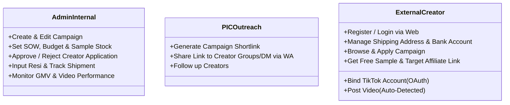
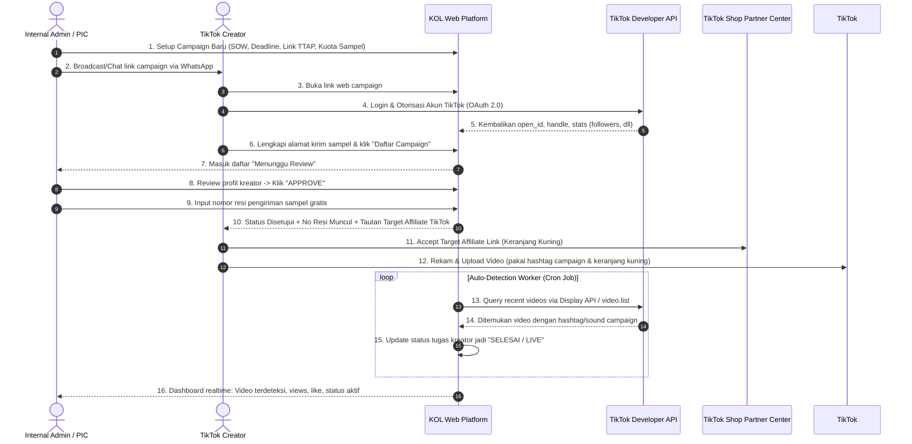

# User Flows, Role Permissions, and Business Rules

## 1. Actor Persona & Roles

---

## 2. End-to-End Workflow Diagram

---

## 3. Database Schema Blueprint (Draft)

1. **`users`**: `id`, `email`, `phone_number`, `role` (ADMIN, PIC, CREATOR), `created_at`.
2. **`tiktok_accounts`**: `id`, `user_id`, `open_id`, `union_id`, `tiktok_handle`, `avatar_url`, `follower_count`, `access_token`, `refresh_token`, `token_expires_at`.
3. **`creator_profiles`**: `id`, `user_id`, `full_name`, `whatsapp_number`, `shipping_addresses` (JSON / Relasi), `bank_account_info` (JSON / Relasi).
4. **`campaigns`**: `id`, `title`, `brand_name`, `banner_image_url`, `commission_type` (COMMISSION_ONLY, FIXED_FEE, HYBRID), `commission_rate_text`, `is_free_sample`, `sample_quota`, `sample_stock_remaining`, `sow_brief_text`, `mandatory_hashtags`, `mandatory_mentions`, `sound_url`, `target_affiliate_link`, `start_date`, `end_date`, `status` (DRAFT, ACTIVE, PAUSED, COMPLETED).
5. **`campaign_applications`**: `id`, `campaign_id`, `creator_id`, `tiktok_account_id`, `status` (PENDING_REVIEW, APPROVED, REJECTED, CANCELLED), `rejection_reason`, `shipping_address_snapshot`, `tracking_number`, `courier_name`, `applied_at`, `reviewed_at`, `reviewed_by`.
6. **`campaign_tasks`**: `id`, `application_id`, `detected_video_id`, `video_url`, `video_title`, `caption`, `views_count`, `likes_count`, `comments_count`, `post_time`, `task_status` (WAITING_SAMPLE, WAITING_POST, DETECTED_ACTIVE, REMOVED_OR_PRIVATE), `last_synced_at`.
