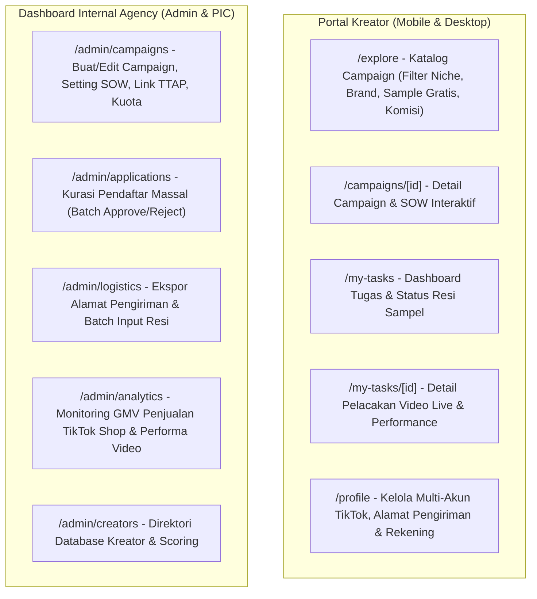
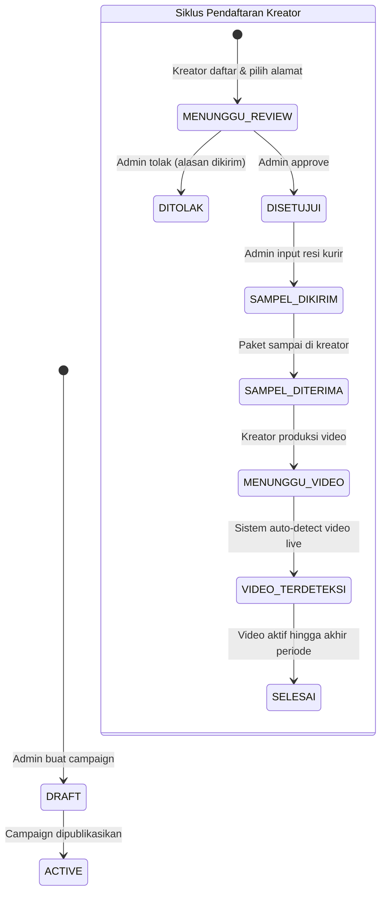

# Product Requirements, Unique UX & Brand Identity

Dokumen ini mendefinisikan identitas unik, arsitektur modul, dan keunggulan kompetitif platform kita agar **tidak terlihat menjiplak Gro Creator**, melainkan menjadi platform yang **jauh lebih profesional, kaya fitur, transparan, dan user-friendly**.

---

## 1. Perbedaan Utama: Versi Kita vs Gro Creator

| Aspek | Gro Creator (Scraped UI) | Platform Kita (Next-Gen Creator Agency Hub) 🚀 |
| :--- | :--- | :--- |
| **Desain Visual & Branding** | Nuansa generik abu-abu/biru standar, layout monolitik. | **Modern Agency Theme**: Dark/Light mode elegan, Card visual dengan preview produk HD, badge status modern (*Glassmorphism* & *HeroUI*), tipografi bersih & mobile-first. |
| **Sistem Kurasi Kreator** | Review pendaftar manual dasar tanpa analitik mendalam. | **Smart Creator Scoring**: Menampilkan riwayat pengerjaan tugas sebelumnya, *Completion Rate* (tingkat ketepatan upload video), rata-rata views TikTok, dan kategori/niche. |
| **Struktur SOW & Panduan Video** | Teks panjang standar dalam modal popup. | **Interactive SOW Checklist**: Brief interaktif (Hook Wajib, Do's & Don'ts, Format Video, Sound Resmi, Hashtag otomatis di-copy dengan 1 klik). |
| **Manajemen Sampel & Pengiriman** | Input resi manual biasa. | **Logistik Batch & Auto-Cetak Resi**: Export alamat massal siap cetak label kurir (J&T, SiCepat, JNE) + pelacakan status resi langsung di web. |
| **Distribusi Link TikTok Shop Target** | Link manual atau text. | **One-Click Target Link Binding**: Tombol langsung membuka aplikasi TikTok / TikTok Shop untuk langsung menambahkan produk ke keranjang kuning kreator. |
| **Deteksi Video Otomatis** | List video biasa. | **Live Video Performance Tracker**: Menampilkan video live TikTok, grafik views harian, like count, dan status apakah keranjang kuning terpasang dengan benar. |

---

## 2. Struktur Modul Aplikasi

---

## 3. Alur Status Komprehensif

