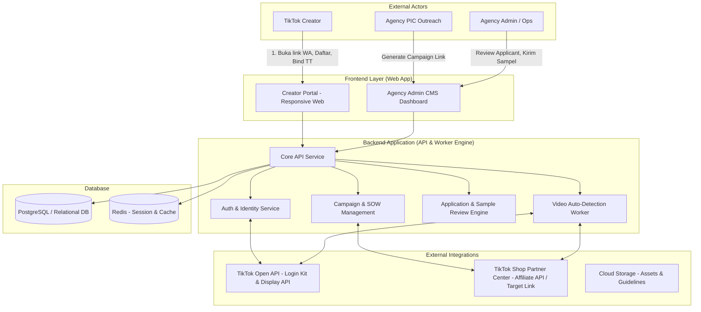

# System Architecture & Product Decisions

## 1. Project Background & Vision
- **Objective**: Membangun Web Platform Scale-Up Agency TikTok Affiliate Partner (seperti *Gro Creator*) untuk mengelola campaign brand, mendistribusikan link affiliate / target collaboration TikTok Shop, kurasi pendaftar, manajemen sampel gratis, dan auto-tracking video tanpa report manual.
- **Agency Role**: Agensi Resmi TikTok (TikTok Affiliate Partner / TAP).
- **Core Value Proposition**:
  - Outreach masif via WhatsApp oleh tim PIC -> Kreator masuk ke Web Portal.
  - Katalog Campaign terstruktur dengan SOW, brief video, sampel gratis, dan potensi komisi.
  - Approval Gate: Kurasi kualitas kreator sebelum sampel dikirim.
  - Seamless Commission: Komisi penjualan otomatis dialokasikan via TikTok Shop ke wallet kreator.
  - Auto-Detection Video: Sistem memantau video postingan kreator otomatis tanpa form lapor link berulang.

---

## 2. Key Decisions & Agreements

| Area | Keputusan | Rasional / Implementasi |
| :--- | :--- | :--- |
| **Affiliate Link & Keranjang Kuning** | Terintegrasi dengan TikTok Shop Partner Center (Target Collaboration / TTAP links). | Agency resmi membuat target link/invitation di Partner Center; kreator bind akun & accept link sehingga GMV dan komisi tercatat resmi. |
| **Model Komisi** | Direct from TikTok Shop | Komisi langsung masuk ke akun TikTok Shop kreator; agency tidak menangani payout manual satu per satu (kecuali jika ada fixed fee barter/reward khusus). |
| **WhatsApp Notification** | Manual PIC WhatsApp (No Unofficial WA Bot) | Menghindari risiko nomor banned Meta. Tim PIC agency mengirimkan link campaign web secara langsung ke grup/DM kreator. |
| **Login & Identity** | Hybrid: Web Auth + TikTok OAuth (Login Kit) | Kreator register akun web lalu bind TikTok ID mereka untuk verifikasi profil, data followers, dan deteksi video. |
| **Video Auto-Detection** | Cron Job / Webhook + TikTok Display API / Partner Tracking | Sistem memantau video terbaru yang diunggah oleh binded creator yang memuat hashtag/sound/keranjang produk campaign. |

---

## 3. High-Level System Architecture

