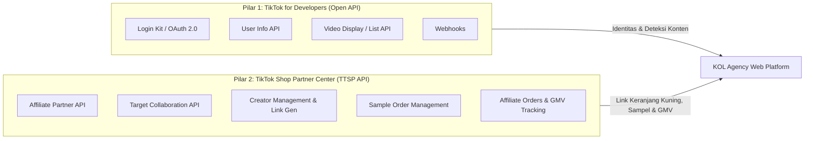

# TikTok API & Ecosystem Integration Guide

Dokumen ini memetakan seluruh API resmi dari **TikTok for Developers (`developers.tiktok.com`)** dan **TikTok Shop Partner Center (`partner.tiktokshop.com`)** yang relevan untuk membangun platform KOL / Affiliate Creator Agency.

---

## 1. Arsitektur Dua Pilar Ekosistem TikTok

Platform agency ini menghubungkan dua pilar resmi TikTok:

---

## 2. Rincian API: TikTok for Developers (Open API)

### A. Login Kit (OAuth 2.0)
- **Fungsi**: Memungkinkan kreator melakukan login / binding akun TikTok resmi ke platform web agency.
- **Endpoint Utama**:
  - Authorize URL: `https://www.tiktok.com/v2/auth/authorize/`
  - Token URL: `https://open.tiktokapis.com/v2/oauth/token/`
  - Refresh Token: `https://open.tiktokapis.com/v2/oauth/token/` (grant_type: `refresh_token`)
- **Required Scopes**:
  - `user.info.basic`: Mendapatkan open_id, union_id, avatar_url, display_name.
  - `user.info.profile`: Mendapatkan bio_description, is_verified, profile_deep_link.
  - `user.info.stats`: Mendapatkan follower_count, following_count, likes_count, video_count.

### B. Display API / Video List API
- **Fungsi**: Digunakan oleh worker sistem untuk mendeteksi video yang baru diposting oleh kreator secara otomatis.
- **Endpoint Utama**:
  - `POST https://open.tiktokapis.com/v2/video/list/`
  - `POST https://open.tiktokapis.com/v2/video/query/`
- **Required Scopes**:
  - `video.list`: Mengambil daftar video publik kreator (title, video_description, create_time, share_url, view_count, like_count, comment_count).
- **Mekanisme Auto-Detection**:
  1. Cron Job berjalan setiap interval tertentu (misal: 15-30 menit).
  2. Worker mengambil video terbaru dari kreator yang status pendaftarannya `APPROVED`.
  3. Worker mencocokkan caption video dengan:
     - Hashtag wajib campaign (contoh: `#MakeOver99`, `#GlowUpBarengEmina`).
     - Mention akun brand / agency.
     - Waktu posting berada dalam rentang `start_date` dan `deadline_date`.
  4. Jika cocok, sistem menandai tugas sebagai `VERIFIED / SUBMITTED`, menyimpan `video_id` & `share_url`, dan menarik metrik performa secara live.

### C. Webhooks (Real-time Event Triggers)
- **Fungsi**: Menerima event saat ada perubahan otorisasi atau update status user tanpa perlu polling berlebih.

---

## 3. Rincian API: TikTok Shop Partner Center (TAP / Partner API)

Sebagai Agensi Resmi TikTok (*TikTok Affiliate Partner*), platform dapat memanfaatkan **TikTok Shop Affiliate Partner API**:

### A. Target Collaboration & Exclusive Product Link
- **Fungsi**: Mengaitkan produk klien/brand dengan penawaran komisi khusus agency dan menghasilkan link/undangan target khusus kreator.
- **Alur Kerja**:
  1. Agency membuat campaign target di TikTok Shop Partner Center atau via API.
  2. Sistem mendapatkan `invitation_id` / `target_link`.
  3. Saat kreator di-*Approve* di sistem web kita, mereka disajikan tombol satu klik / link untuk langsung menambahkan produk ke keranjang kuning / showcase mereka.

### B. Sample Management API (Opsi Integrasi Otomatis)
- **Fungsi**: Mengelola request sampel gratis kreator yang terintegrasi dengan persetujuan penjual/brand di TikTok Shop.

### C. Performance & GMV Tracking API
- **Fungsi**: Menarik agregasi data performa (GMV, total item terjual, estimasi komisi per video/kreator) langsung dari Partner Center untuk dashboard analitik internal agency.

---

## 4. Keamanan & Compliance
1. **Access Token Management**: Simpan `refresh_token` terenkripsi (AES-256) di database backend. Lakukan rotasi token sebelum masa berlaku habis.
2. **Rate Limiting**: Ikuti rate limit TikTok API (umumnya 10-20 requests/second per client) dengan menerapkan Redis queue (BullMQ/Celery).
3. **Data Privacy**: Hanya gunakan data profil dan video untuk keperluan verifikasi campaign agency sesuai Privacy Policy TikTok.
