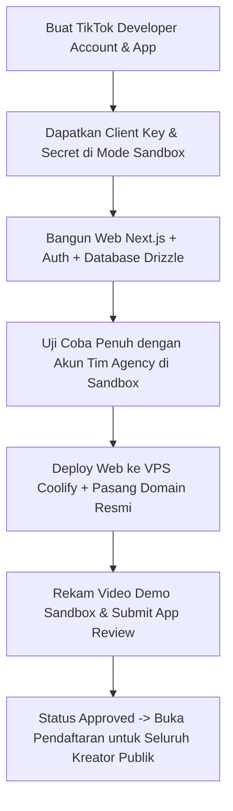

# TikTok App Review & Sandbox Strategy

## 1. Mekanisme Sandbox vs Live (Production)

| Tahap | Status Review | Siapa yang Bisa Pakai? | Batasan / Syarat |
| :--- | :--- | :--- | :--- |
| **Tahap 1: Sandbox (Development)** | **Tanpa Review (Langsung Aktif)** | Akun TikTok yang didaftarkan sebagai *Tester* di Developer Portal (hingga 5–10 akun tim internal agency). | Kuota terbatas untuk tester, sangat ideal untuk membangun seluruh fitur dari nol tanpa menunggu persetujuan TikTok. |
| **Tahap 2: Live (Production)** | **Wajib App Review** | Seluruh kreator publik di TikTok. | Memerlukan video demo flow, URL website aktif, Privacy Policy, Terms of Service, dan justifikasi scopes. |

---

## 2. Analisis Aturan Review: Apakah Ribet?

Aturannya **tidak rumit, tetapi sangat prosedural dan ketat pada checklist compliance**. Jika checklist ini terpenuhi, review biasanya disetujui dalam 3–5 hari kerja.

### Checklist Wajib Lolos Review:
1. **Nama & Icon Aplikasi**:
   - ❌ **DILARANG**: Memakai kata "TikTok" (contoh: *TikTok KOL Manager*, *TikTok Booster*).
   - ✅ **DIPERBOLEHKAN**: Nama brand agensi Anda (contoh: *GroAgency Creator Hub*, *StarKOL Portal*).
   - Ikon aplikasi harus jelas dan tidak meniru logo TikTok.
2. **Website Publik & URL Redirect**:
   - URL website harus aktif dan bukan halaman kosong/under construction.
   - Wajib ada link aktif **Privacy Policy** dan **Terms of Service** di footer.
3. **Video Demo Rekaman Layar (Screen Recording Wajib)**:
   - Video MP4 ($\le 50\text{ MB}$) yang memperlihatkan end-to-end flow di mode Sandbox:
     1. Kreator membuka website agency.
     2. Menekan tombol "Hubungkan Akun TikTok".
     3. Tampil consent screen otorisasi TikTok resmi.
     4. Redirect kembali ke dashboard dan data profil/video terhubung sukses.
4. **Scope Justification**:
   - Hanya minta scope yang benar-benar dipakai:
     - `user.info.basic` & `user.info.profile`: Menampilkan nama & avatar kreator di profil.
     - `user.info.stats`: Verifikasi jumlah followers untuk syarat campaign.
     - `video.list`: Mendeteksi apakah video tugas campaign sudah diposting oleh kreator.

---

## 3. Strategi Pengembangan Agency (Zero-Downtime Timeline)

